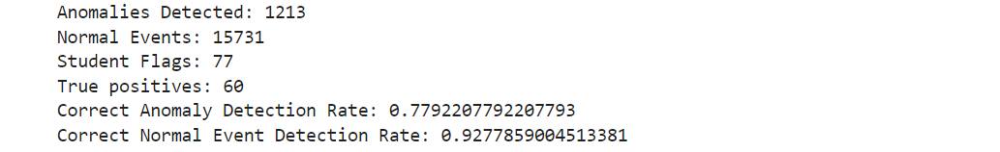
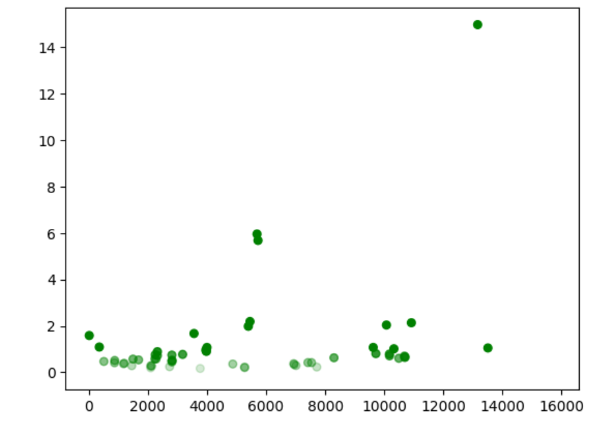

# DataMining-HW2
Final submission for Homework 2 in data mining. Group members: Jerrica Deloatch, Chris Johnson, Robert Johnson
Implements a sliding window threshold calculation to determine anomalies in a time-series dataset. Delivered via jupyter notebook file.

## Requirements
jupyter (or alternative)

This program is saved as an ipynb file so to run this you need something capable of running ipynb files. Typically this is done through jupyter notebooks but you can choose whatever

numpy,
pandas,
matplotlib.pyplot (optional)

All 3 of these can be downloaded easily using pip via command line. Note that matplotlib is optional, it is only used to plot the results of the program once it is finished, if you don't wish to plot them you can simply remove this import.

## Usage
Ensure that you have the file 'AG_NO3_fill_cells_remove_NAN.csv' in the same directory as the ipynb file. Note that the window size and quotient are pre-set in lines 11-12 as the variables 'window' and 'q', these can be adjusted however you see fit as long as 100 > q > 0 and window > 0. Upon completion the program reports the numbers of: Anomalies Detected, True Normal Events in the dataset, Student Flags, and True Positives. It also calculates the following: Correct Anomaly Detection Rate, and Correct Normal Event Detection Rate.

The second cell plots the Correctly detected anomalies via a scatter-plot. Note, you must have matplotlib imported for this cell to work.

## Discusion
This was a rather brute force way to attempt anomaly detection. Originally our code checked and updated every data point in the window at each step. This led to very poor performance time-wise and detection wise. Perhaps we were overfitting the data in this approach. In our final approach it checks every data point only once. This led to much better performance time-wise but may have led to underfitting in our detection since there was a high number of false positives. The model has decent recall at 0.779 yet its precision leaves much to be wanted at only 0.049. Regardless it met the requirements set by the instructor especially outperforming the minimum normal event detection accuracy rate of 80%.

## Results
Below is our output for the program when run with a window size of 100 and a threshold of 97.5.

Below is our plotted results. Points indicate true positives.

